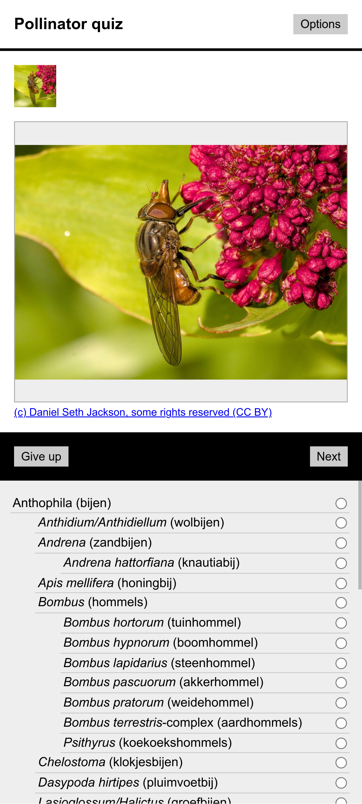
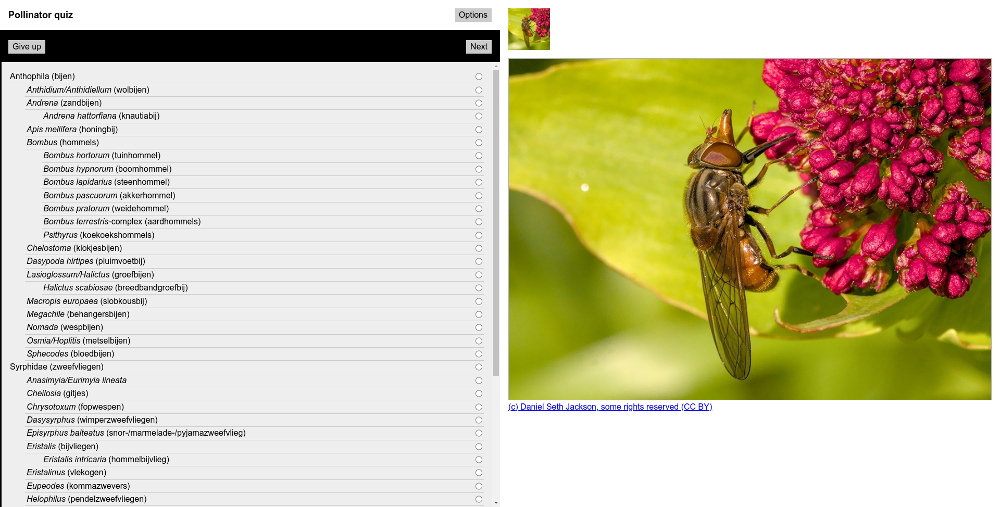

# Wikimedia Biodiversity matcher

Do your best to match open-licensed pictures to taxonomic groups!

  - Arthropoda, Wikimedia: https://larsgw.github.io/biodiversity-matcher/
  - Flora, Wikimedia: https://larsgw.github.io/biodiversity-matcher/flora/
  - Arthropoda, iNaturalist: https://larsgw.github.io/biodiversity-matcher/inat/

---

